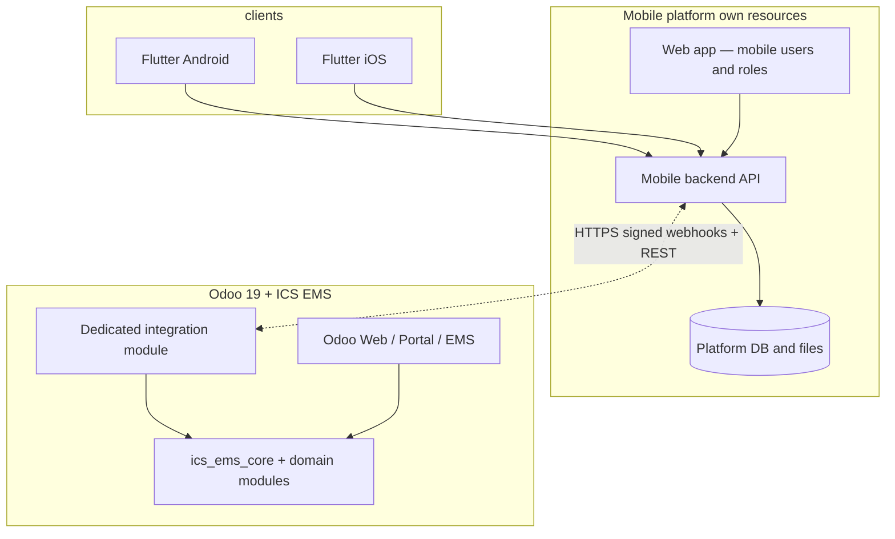
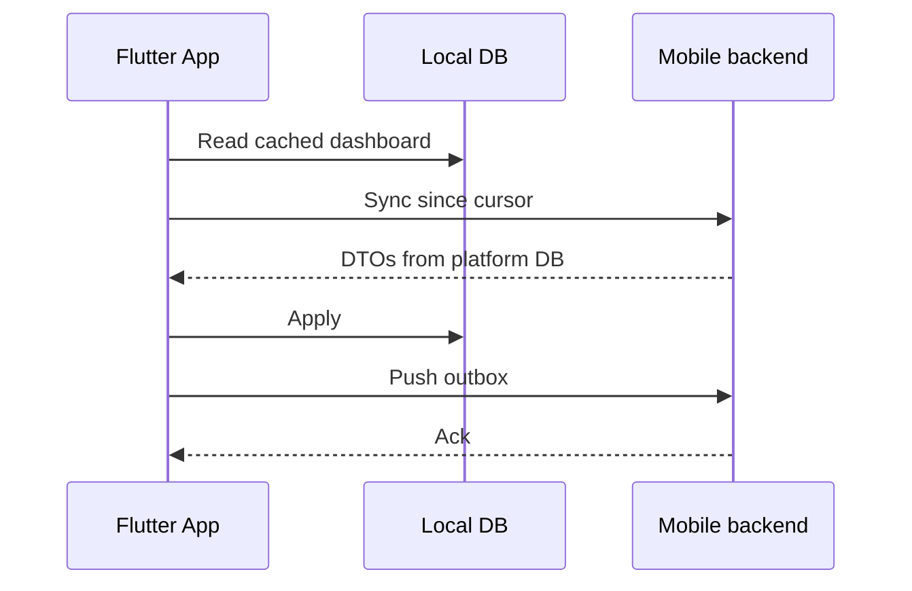
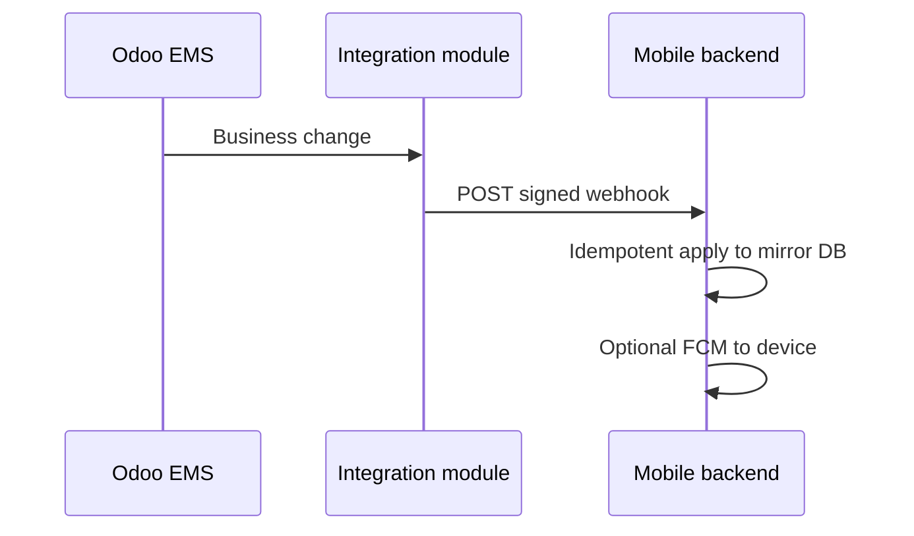
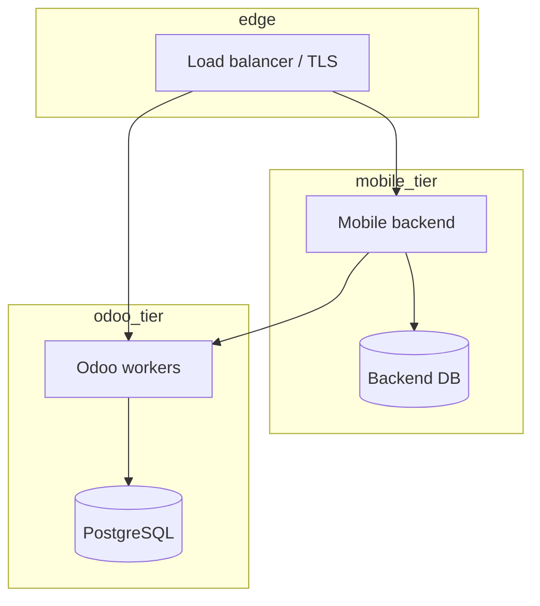

# EMS Flutter Mobile App — Technical Architecture

Companion to [EMS_FLUTTER_MOBILE_SPECIFICATION.md](./EMS_FLUTTER_MOBILE_SPECIFICATION.md). For a copy-paste build prompt, see [EMS_IMPLEMENTATION_MASTER_PROMPT.md](./EMS_IMPLEMENTATION_MASTER_PROMPT.md).

---

## 1. System context (autonomous mobile platform + webhook EMS bridge)



- **Flutter** uses **only** the **mobile backend**. The consumer app is **not coupled** to Odoo and carries **no Odoo secrets**.
- **Mobile platform** (backend + **its** database, object/file storage as designed, admin web) is a **separate system** that can run **all non-EMS features** and serve the app **without** the phone ever calling Odoo.
- **EMS-related data** is **exchanged** with Odoo through a **defined webhook contract** implemented in the **dedicated integration module** (Odoo → backend notifications) plus **authenticated REST or inbound webhooks** (backend → Odoo for writes, bootstrap, reconciliation). The backend maintains an **EMS mirror / cache** as needed so reads are served from the **platform** after sync.
- **`ics_ems_mobile_app` / `ics_ems_api`** remain **reference** only; production integration is the **dedicated module** + webhook catalogue.

**EMS staff administration** stays on **Odoo web**; mobile admin web is not Odoo back office.

---

## 2. Logical architecture (Flutter)

Recommended **clean layering** (consistent with MVVM patterns seen in `Our-E-School` and GetX-style separation in `SchoolMate` examples):

| Layer | Responsibility |
|-------|----------------|
| **Presentation** | Widgets, screens, navigation, role-specific shells (parent / student / teacher / optional **school office** for requests & chat only—**no** Odoo EMS admin shell). |
| **Application** | Use cases: “Load children”, “Submit attendance delta”, “Sync fees”. |
| **Domain** | Entities, value objects, repository interfaces (Dart abstract classes). |
| **Data** | **Mobile backend** REST client (Dio), DTOs, local DB (Hive / SQLite), sync engine; **no** Odoo client in the app. |

**State management (agreed stack):** **Cubit** from `flutter_bloc` for predictable state and testability. (Riverpod remains an acceptable alternative only if the team standardises on one approach.)

**Navigation:** **GoRouter** for declarative routes and **deep linking** (push → screen mapping; see specification Phase 5).

**Networking:** **Dio** interceptors for base URL, auth header / cookie handling, logging (debug), and retries.

**Local persistence:** **Hive** for structured cache and offline queues, *or* **shared_preferences** for light flags only — avoid storing secrets in prefs; use **flutter_secure_storage** for tokens.

**Single codebase:** `lib/app.dart` bootstraps `RoleShell` from **mobile backend** JWT claims (`app_role`, `permissions`) and optional `school_id`. **MVP:** parent-only gate enforced in **backend** and again in **Odoo** inside the integration module.

---

## 3. Odoo side (this repository + new module)

### 3.1 Dedicated Odoo 19 integration module (to implement)

**Purpose:** the **only** bridge between **Odoo EMS** and the **mobile backend**: (1) **outbound webhooks** from Odoo to the backend, (2) **inbound** authenticated APIs (and optionally **inbound webhooks** into Odoo) for writes and reconciliation.

**Outbound webhooks (Odoo → mobile backend)** — **primary** for EMS-aligned sync:

- Register HTTPS URL(s) on the mobile backend (per environment), e.g. `POST /integrations/odoo/v1/webhooks`.
- On relevant EMS model changes (signals/`create`/`write`/workflow), enqueue a **signed** payload: `event`, `resource`, `ids`, `write_date`/version, `school_id`, `delivery_id` for idempotency.
- **Retries:** if the backend returns 5xx or times out, Odoo should **queue and retry** (exponential backoff, dead-letter in Odoo) so no silent loss.
- **Security:** HMAC signature (shared secret rotated) or mTLS; reject replays using `delivery_id` / timestamp window.

**Inbound from mobile backend (backend → Odoo):**

- Versioned REST on the module, **or** `POST` to `/ems/integration/v1/inbound/...` webhook-style handlers — same auth model.
- Used for: initial user bootstrap, forced full sync, parent-submitted actions that must persist in EMS, payment confirmation, attachment hand-off.

**Also:** logging (`ics.api.log`-style), rate limits, mapping to EMS models without duplicating business rules.

**Naming:** e.g. `ics_ems_mobile_gateway` — keep separate from `ics_ems_mobile_app` if the latter remains for legacy direct-mobile experiments.

### 3.2 Reference: `ics_ems_mobile_app` (existing)

- `mobile_api.py` — direct phone → Odoo pattern; **deprecated** for the target architecture unless you keep a fallback.
- Useful reference for **parent–student** checks and payload shapes when porting into the dedicated module.

### 3.3 Reference: `ics_ems_api`

- Key-based JSON routes — reuse **ideas** for logging and rate limits on the **integration module**.

### 3.4 `ics_ems_parent_portal` and EMS core

- Business rules and portal visibility remain authoritative in Odoo; the integration module should **delegate** to the same models (`ics.student`, fee moves, etc.) rather than duplicating logic.

---

## 4. Integration patterns

### 4.1 Transport and serialization

- **Flutter → mobile backend:** plain **HTTPS JSON** (REST). Version paths (`/v1/`).
- **Mobile backend → Odoo integration module:** REST or JSON-RPC **as implemented in the module**; prefer **REST + OpenAPI** for contract testing between teams.

### 4.2 Authentication

| Layer | Mechanism |
|-------|-----------|
| **Flutter** | **JWT** (or opaque session id) from **mobile backend**; refresh token rotation; Secure Storage. |
| **Mobile backend → Odoo** | Service credentials + **per-request user context** for data scoping (see integration module design). |
| **Mobile admin web** | Same backend auth or separate admin RBAC with MFA recommended. |

Odoo **session cookies** are **not** used by the Flutter app in the target model.

### 4.3 Authorisation

- **Mobile backend** enforces **app roles** and rate limits.
- **Odoo integration module** enforces **business ACLs** (parent ↔ children, teacher ↔ classes). Both layers must agree; Odoo is the final gate.

### 4.4 Sync strategy

**A. App ↔ platform (always)**



**B. EMS data: Odoo webhooks → platform (primary path for Odoo-originated changes)**



**C. EMS writes: platform → Odoo (API or inbound webhook)**

- Mobile **outbox** is processed by the backend; backend calls **integration module** (or sends inbound webhook to Odoo); Odoo returns ack; backend marks outbox done and may emit FCM.

- **Cursors** on the platform DB track last known EMS `write_date` per resource family; **reconciliation job** fills gaps if webhooks were missed.
- **Outbox** on device → **backend** → Odoo with **`client_operation_id`** idempotency end-to-end.

### 4.5 Files and attachments

- Flutter uploads to **mobile backend** (multipart); backend streams to Odoo **integration module** (`ir.attachment`) or returns **presigned URL** pattern if implemented — virus scan at backend or edge.

### 4.6 Push notifications

- **mobile backend** owns **FCM** and device tokens. **Odoo does not push FCM directly** in the target model: Odoo emits **webhooks** → backend updates mirror → backend sends FCM (deep links for **GoRouter**).

### 4.6.1 Webhook ↔ FCM mapping

- Each **webhook `event` type** maps to zero or one **FCM notification template** and optional **silent sync** (refresh mirror slice only).

### 4.7 Webhook contract (summary)

| Concern | Rule |
|---------|------|
| **Versioning** | `integration_contract_version` in payload; reject unknown major versions. |
| **Idempotency** | Unique `delivery_id` per POST; backend stores processed ids ≥ 24h (or TTL policy). |
| **Ordering** | Per `(school_id, resource, id)` use `write_date`; backend applies monotonic updates only. |
| **Signing** | `X-EMS-Signature: t=<unix_ts>,v1=<hex_hmac_sha256(secret, "v1." + ts + "." + raw_body)>`; reject if drift > 300 s. |
| **Retry** | Exponential backoff in Odoo: `30s → 1m → 5m → 15m → 1h → 4h → 12h → 24h`; max 8 attempts; then `dead`. |

#### 4.7.1 Webhook event catalogue **v0** (12 events)

Common envelope:

```json
{
  "integration_contract_version": "1.0",
  "delivery_id": "uuid-v4",
  "event": "<event name>",
  "resource": "<odoo model>",
  "ids": [123],
  "school_id": 1,
  "occurred_at": "2026-05-09T10:15:00Z",
  "write_date": "2026-05-09T10:14:59Z",
  "data": { "...minimal fields per event..." }
}
```

| # | Event | Resource | When | FCM template | Mirror table |
|---|-------|----------|------|--------------|--------------|
| 1 | `student.created` | `ics.student` | create | – | `ems_student` |
| 2 | `student.updated` | `ics.student` | write of indexed fields (grade/division/state) | – | `ems_student` |
| 3 | `student.parent_link.changed` | `ics.parent` ↔ `ics.student` | M2M change | – | `ems_student_parent` |
| 4 | `fee.invoice.posted` | `account.move` | state → posted (student fee) | `fee_due` | `ems_invoice` |
| 5 | `fee.invoice.paid` | `account.move` | payment_state → paid | `fee_paid` | `ems_invoice` |
| 6 | `fee.invoice.cancelled` | `account.move` | state → cancel | – | `ems_invoice` |
| 7 | `attendance.recorded` | `ics.student.attendance` | create | `attendance_absent` if absent | `ems_attendance` |
| 8 | `attendance.updated` | `ics.student.attendance` | write of `status` | conditional | `ems_attendance` |
| 9 | `exam.result.published` | `ics.student.grade` | state → published | `exam_result` | `ems_exam_result` |
| 10 | `report_card.published` | `ics.report.card` | state → published | `report_card` | `ems_report_card` |
| 11 | `leave_request.state_changed` | `ics.leave.request` | workflow change | `leave_state` | `ems_leave_request` |
| 12 | `announcement.published` | `mail.message` (school channel) or custom | when sent | `announcement` | `ems_announcement` |

Extending the catalogue is allowed per release with a **minor** version bump (e.g. `1.1`); breaking changes require a **major** bump and a documented migration window.

### 4.8 REST API inventory (mobile backend, public)

```
POST   /v1/auth/login                  -> {access, refresh, user, app_role, school_id}
POST   /v1/auth/refresh                -> {access, refresh}
POST   /v1/auth/logout                 -> {ok}
POST   /v1/auth/forgot-password        -> {ok}
POST   /v1/auth/reset-password         -> {ok}

GET    /v1/me                          -> profile + linked students summary
GET    /v1/children                    -> [{student_id, name, grade, division, school_id}]
GET    /v1/children/{id}               -> details
GET    /v1/children/{id}/attendance    -> ?from=&to= paginated
GET    /v1/children/{id}/results       -> exam results / report cards
GET    /v1/children/{id}/invoices      -> ?state= paginated

GET    /v1/invoices/{id}               -> details + lines + payment_state
POST   /v1/invoices/{id}/pay-init      -> {payment_url}

GET    /v1/results/{id}
GET    /v1/documents
POST   /v1/documents                   -> multipart upload (proxied to Odoo ir.attachment)
GET    /v1/documents/{id}/download

GET    /v1/requests
POST   /v1/requests                    -> create with client_operation_id
GET    /v1/requests/{id}

POST   /v1/sync                        -> { cursors:{...} } returns deltas
POST   /v1/devices                     -> register FCM token
DELETE /v1/devices/{id}

GET    /v1/config                      -> {min_app_version, maintenance_banner, feature_flags}
GET    /v1/notifications

POST   /integrations/odoo/v1/webhooks  -> inbound from Odoo (HMAC-protected)

# Admin (cookie + admin role)
GET    /admin/v1/users
POST   /admin/v1/users/invite
POST   /admin/v1/users/{id}/role
POST   /admin/v1/users/{id}/disable
GET    /admin/v1/audit
GET    /admin/v1/feature-flags
PUT    /admin/v1/feature-flags/{key}
GET    /admin/v1/min-app-version
PUT    /admin/v1/min-app-version
GET    /admin/v1/webhook-deliveries
POST   /admin/v1/webhook-deliveries/{id}/replay
```

### 4.9 Odoo gateway REST surface (server-to-server only)

```
POST   /ems/integration/v1/auth/verify
GET    /ems/integration/v1/me
GET    /ems/integration/v1/children
GET    /ems/integration/v1/children/{id}
GET    /ems/integration/v1/children/{id}/attendance
GET    /ems/integration/v1/children/{id}/results
GET    /ems/integration/v1/children/{id}/invoices
GET    /ems/integration/v1/invoices/{id}
POST   /ems/integration/v1/invoices/{id}/pay-init
GET    /ems/integration/v1/documents
POST   /ems/integration/v1/documents
GET    /ems/integration/v1/requests
POST   /ems/integration/v1/requests
GET    /ems/integration/v1/reconcile
POST   /ems/integration/v1/webhooks/inbound
```

### 4.8 In-app payments and store

- **Amazon Pay / hosted checkout:** Flutter initiates via **mobile backend**; backend calls Odoo (payment transaction, invoice state) through the **integration module**; idempotent confirm; Odoo may **webhook** payment state back for final UI sync.
- **Store:** backend proxies cart/sale flows to Odoo; app never holds payment provider secrets.

---

## 5. Deployment topology



- **Scaling:** scale **mobile backend** independently from Odoo; use connection pooling and timeouts to Odoo.
- **Environments:** separate credentials for Odoo **integration module** per env; separate FCM project per env.
- **Webhooks:** mobile backend URL must be **reachable from Odoo** (public HTTPS or VPN); document firewall allowlist; use separate signing secret per env.

---

## 6. Gap analysis vs target architecture

| Capability | Repository status | Action |
|------------|-------------------|--------|
| **Dedicated Odoo 19 integration module** | Not present as a single gateway contract | **Implement** new addon: REST surface, auth for mobile backend, webhooks, mapping to EMS models. |
| **Mobile backend + admin web** | Out of repo (or new services folder) | Implement per stack choice (e.g. FastAPI/Nest/.NET). |
| Teacher / student / school-office APIs | Only samples in `mobile_api.py` | Port into **integration module** for backend consumption only. |
| JWT for Flutter | N/A in Odoo-only-old path | Issued by **mobile backend**. |
| Delta sync | N/A | Platform DB cursors + **webhook-driven** EMS mirror; reconciliation **pull** on integration module if webhooks missed. |
| FCM | Optional in Odoo | **Backend-only** FCM; triggered after webhook processing or local platform events. |
| **Webhook queue in Odoo** | N/A | Outbound delivery worker + retry/DLQ when mobile backend unreachable. |

---

## 7. Security checklist

- HTTPS only; HSTS at load balancer for **both** mobile API and Odoo.
- **Odoo integration module:** API keys / OAuth **only** for **mobile backend** service identity; never ship to Flutter.
- **Flutter:** user JWT from backend only; **OWASP Mobile Top 10** (Secure Storage, etc.).
- **Logging:** never log passwords; correlate backend ↔ Odoo with request id in integration module logs.

---

## 8. Observability

- Client: crash reporting (Firebase Crashlytics / Sentry), anonymised performance traces.
- Server: Odoo logs + optional OpenTelemetry exporter; rate limit public routes at reverse proxy.

---

## 9. Repository map (quick reference)

| Path | Role |
|------|------|
| **New:** `ics_ems_mobile_gateway` (or chosen name) | **Target:** Odoo API for mobile backend only |
| `ics_ems_mobile_app/controllers/mobile_api.py` | Legacy reference: direct phone → Odoo |
| `ics_ems_api/controllers/api_v1.py` | Reference: API key + logging patterns |
| `ics_ems_parent_portal/controllers/portal.py` | Business/portal behaviour to mirror in gateway |
| `ics_ems_core` + domain EMS modules | Data and rules |
| `MODULES_OVERVIEW.md` | EMS module catalogue |
| `altatheeb_mobile_app/examples/` | Flutter UX/architecture patterns |

---

*Document version: 2.2 — **Target:** autonomous mobile platform (own DB/resources); **EMS sync** with Odoo via **signed webhooks** + dedicated Odoo 19 integration module (`ics_ems_mobile_gateway`); Flutter only → mobile backend. Added webhook event catalogue v0 (12 events), HMAC signature contract, retry/backoff, and full REST API inventory for backend public surface and Odoo gateway server-to-server surface.*
